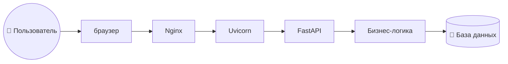

# Приложение для работы с базой

## Проект создан для работы в среде предназначен как проект по управлению файлами и базой данных

- Почтовая рассылка
- Просмотр файлов списком и по содержимому
- Опись файлов

## Стек

1. FastAPI
1. PostgreSQL
1. Apache Kafka

## Общая логика ПО

чтобы отображалось корректно установи ***mermaid*** в IDE



## Способы запуска

1. описание
   ```bash
    fastapi dev app_main.py
    ```
2. описание
    ```bash
   unicorn main:app --reload
   ```
3. описание
   ```bash
   python app_main.py
   ```
4. Собрать код для ИИ

```bash
  powershell -NoProfile -ExecutionPolicy Bypass -File .\collect.ps1
```

# Установить зависимости

```bash
    pip install -r requirements.txt
```
## Alembic
### Активируйте виртуальное окружение
```
.venv\Scripts\activate
```
### Создайте первую миграцию (autogenerate)
```
alembic revision --autogenerate -m "Initial migration with all schemas"
```
### Примените миграции
```
alembic upgrade head
```
### Откатите миграции (если нужно)
```
alembic downgrade -1
```
### Посмотрите историю миграций
```
alembic history --verbose
```
### Проверьте текущую версию
```
alembic current
```

### Автоматическая генерация миграции на основе моделей
```
alembic revision --autogenerate -m "initial migration - create all tables"
```
### Затем примените миграцию:
```
alembic upgrade head
```
## Запуск прилоежения в фоновом режиме
```
nohup uvicorn src.main:app --host 0.0.0.0 --port 8081 > logs/uvicorn.log 2>&1 &
```